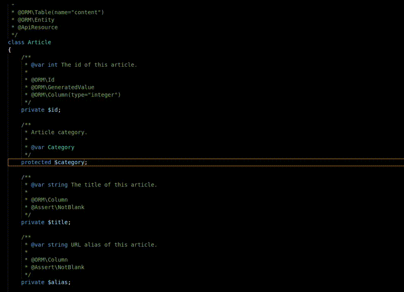

# PHP getters and setters for Visual Studio Code

> Fast generator of getters and setters for your PHP class properties.



## Features

This extension allows you to quickly generate getters and setters with one single command.

Features:

* Detects indentation. No matter if you use spaces or tabs.
* Uses configuration options to show doc blocks as you like them.
* Generates method's descriptions based on the property description.
* Detects valid type hints to use them in the setter.

It adds 3 comands to vscode's command palette:

* Insert PHP getter.
* Insert PHP setter.
* Insert PHP getter and setter.

You can also access commands from contextual menu when clicking on a class property:


## Extension Settings

This extension contributes the following settings:

* `phpGettersSetters.spacesAfterParam`: Number of spaces to insert between @param tag and variable name in doc blocks. Default: 2
* `phpGettersSetters.spacesAfterParamVar`: Number of spaces to insert after the variable name in the @param tag line. Default: 2
* `phpGettersSetters.spacesAfterReturn`: Number of spaces to insert after the @return tag. Default: 2
* `phpGettersSetters.redirect`: Redirect editor to generated functions after generating them? Default: true
* `phpGettersSetters.templatesDir`: Folder where custom templates are stored
* `phpGettersSetters.getterTemplate`: File to use as template for getters. Default: getter.js
* `phpGettersSetters.setterTemplate`: File to use as template for setters. Default :setter.js

## Custom Templates

By default this extension will use a custom function to generate your getters & setters but you can fully customise the markup used to generate them. By default templates are stored in:

* Linux: `~/.config/Code/User/phpGettersSetters`
* OSX: `~/Library/Application Support/Code/User/phpGettersSetters`
* Windows: `%APPDATA%\Code\User\phpGettersSetters`

You can also set a custom templates dir entering a custom folder in `phpGettersSetters.templatesDir` setting.

Template Literals are used for templating because the flexibility they provide. With them you can easily create a custom template with no knowledge and also invest some time for complex things. For advanced usage you will have to google about template literals but here are 2 sample templates.

Sample getter.js template:

```
module.exports = (property) => `
	/**
	 * ${property.getterDescription()}
	 *
	 * @return  ${property.getType() ? property.getType() : 'mixed'}
	 */
	public function ${property.getterName()}()
	{
		return $this->${property.getName()};
	}
`
```

Sample setter.js template:

```
module.exports = (property) => `
	/**
	 * ${property.setterDescription()}
	 *
	 * @param   ${property.getType() ? property.getType() : 'mixed'}  \$${property.getName()}  ${property.getDescription() ? property.getDescription() : ''}
	 *
	 * @return  self
	 */
	public function ${property.setterName()}(${property.getTypeHint() ? property.getTypeHint() + ' ' : '' }\$${property.getName()})
	{
		$this->${property.getName()} = \$${property.getName()};

		return $this;
	}
`
```

As you can see a [Property](blob/master/src/Property.ts) object is passed to templates so you can access any public method there. I also like the idea of adding more stuff as users find limits. Open an issue if you find something you cannot achieve.

## Release Notes

Relevant releases:

### 1.2.0
* Added support for custom templates

### 1.1.0
* Added support for multiple cursor

### 1.0.5
* Fixed `No property found` when switching between editors. Thanks for reporting Carlos Alfonso Pérez Rivera!

### 1.0.3

* Added context menu links

### 1.0.0

* Initial version
